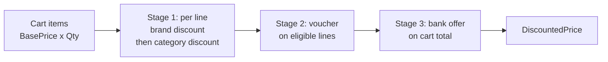

# Unifize Discount Service

A Go discount engine for a fashion e-commerce storefront. It prices a cart by
stacking brand, category, voucher and bank-card discounts, and validates voucher
codes against brand exclusions, category restrictions and customer tiers.

## Running

Requires Go 1.24+ and, for linting, golangci-lint v2.

```bash
# Run the test suite
go test ./...

# Price the sample PUMA T-shirt cart (brand + category + ICICI bank offer)
go run ./cmd/demo

# Same cart with a voucher code
go run ./cmd/demo -voucher SUPER69

# Format and lint (golangci-lint v2)
go fmt ./...
golangci-lint run
```

A `Makefile` wraps these as `make test`, `make run`, `make fmt` and `make lint`.

## Project layout

```
cmd/demo/                 demo CLI that prices the sample cart
internal/models/          domain types (given models + Discount rule definition)
internal/repository/      DiscountRepository interface + in-memory implementation
internal/service/         DiscountService interface, implementation, errors, tests
testdata/fake_data.go     fake products, discounts, vouchers, customers, payments
```

## Pricing pipeline



Worked example from `testdata` (PUMA T-shirt, base price 1000, ICICI credit card):

| Stage    | Discount                                  | Amount | Running price |
|----------|-------------------------------------------|-------:|--------------:|
| Brand    | Min 40% off on PUMA                        |    400 |           600 |
| Category | Extra 10% off on T-shirts                  |     60 |           540 |
| Bank     | 10% instant discount on ICICI Bank cards   |     54 |       **486** |

## Assumptions

- **Discounts compound.** Each stage applies its percentage to the price left
  after the previous stage, not to the base price (40% + 10% + 10% gives 48.6% of
  base, not 40%).
- **"Min 40% off" is modelled as a flat 40%.** In a real catalogue "min" is
  marketing copy over per-product discounts of at least 40%. A per-product
  percentage can be modelled later without changing the pipeline.
- **The service recomputes prices from `BasePrice`.** `Product.CurrentPrice` is
  treated as a display field supplied by the catalogue and is not trusted as
  input, so the cart total can't be altered by a stale or client-supplied price.
- **At most one discount per type per line.** If several brand (or category)
  discounts match, the one giving the largest amount wins. The same applies to
  bank offers at cart level.
- **Only one voucher per cart.**
- **Vouchers only discount eligible lines.** A code is valid if at least one cart
  item passes its brand exclusions and category restrictions. Ineligible items
  are simply not discounted.
- **Bank offers match on payment method, bank name and optional card type**,
  all case-insensitively.
- **Money is rounded to 2 decimal places** at each discount step.
- **Customer tiers** are ordered `regular < silver < gold < platinum`.
- **Validity windows** use zero `time.Time` values to mean "open-ended".

## Technical decisions

- **The voucher code travels in the `context.Context`.** The required
  `CalculateCartDiscounts` signature has no parameter for a coupon code, yet the
  pipeline must apply one. Rather than changing the given interface,
  `service.WithVoucherCode(ctx, code)` attaches a request-scoped code.
- **`ValidateDiscountCode` returns `(false, *ValidationError)`** when a code
  can't be used. `ValidationError` wraps a sentinel (`ErrDiscountExpired`,
  `ErrCustomerTierNotEligible`, ...) so callers can branch with `errors.Is` and
  show `Detail` to the customer.
- **Rules come from a `DiscountRepository` interface.** The service has no
  hard-coded offers; the in-memory repository could be swapped for a database
  without changes to the service.
- **The clock is injectable** (`WithClock`) so validity windows are tested
  deterministically.
- **`shopspring/decimal`** is used for all money arithmetic to avoid float errors.
- **Fixtures live in `testdata/`** as required. The `go` tool skips `testdata`
  directories when matching `./...`, but the package can still be imported by
  tests and the demo.
