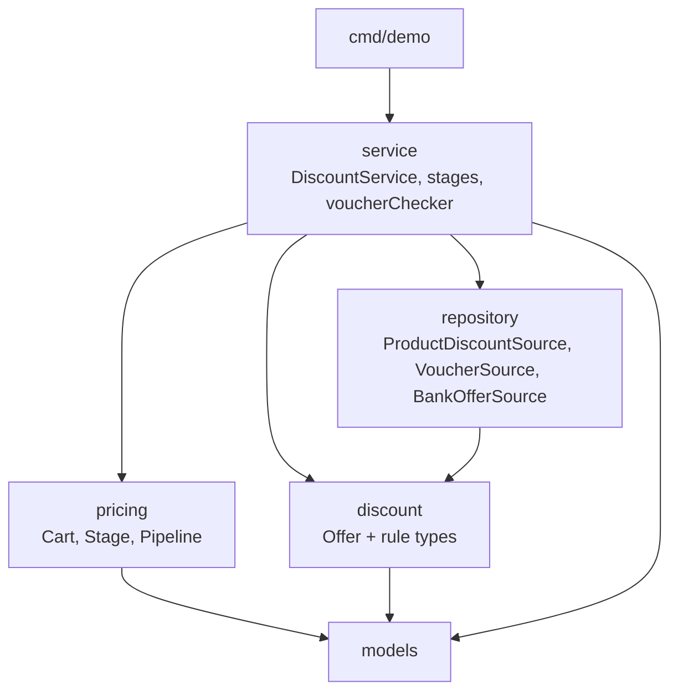
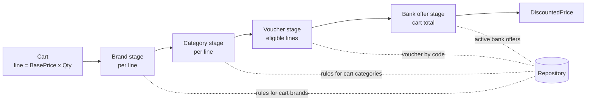

# Unifize Discount Service

A Go discount engine for a fashion e-commerce storefront. It prices a cart by
stacking brand, category, voucher and bank-card discounts, and validates voucher
codes against brand exclusions, category restrictions and customer tiers.

## Running

Requires Go 1.24+ and, for linting, [golangci-lint v2](https://golangci-lint.run/).

```bash
# Run all tests (unit, table-driven and runnable examples)
go test ./...

# Price the sample PUMA T-shirt cart: brand + category + ICICI bank offer
go run ./cmd/demo

# Same cart with a voucher code
go run ./cmd/demo -voucher SUPER69

# Format, lint, benchmark
go fmt ./...
golangci-lint run
go test ./internal/service -run '^$' -bench . -benchmem
```

The `Makefile` wraps these: `make test`, `make run`, `make fmt`, `make lint`,
`make bench`, `make cover`.

Sample output of `go run ./cmd/demo`:

```json
{
  "original_price": "1000",
  "final_price": "486",
  "applied_discounts": {
    "10% instant discount on ICICI Bank cards": "54",
    "Extra 10% off on T-shirts": "60",
    "Min 40% off on PUMA": "400"
  },
  "message": "Applied 3 discount(s): you save 514.00 (51.40%)"
}
```

## Project layout

```
cmd/demo/               demo CLI that prices the sample cart
internal/models/        types given by the assignment (Product, CartItem, ...)
internal/discount/      rule types: Offer, BrandDiscount, CategoryDiscount, Voucher, BankOffer
internal/pricing/       Cart pricing state, Stage interface, Pipeline
internal/repository/    rule source interfaces + validated, indexed in-memory implementation
internal/service/       DiscountService, pricing stages, voucher checks, errors
testdata/fake_data.go   fake products, rules, customers and payments
```

## Architecture



`CalculateCartDiscounts` builds a `pricing.Cart` and runs it through a pipeline
whose order is declared once, in `NewDiscountService`:



Worked example (PUMA T-shirt, base price 1000, ICICI credit card):

| Stage    | Discount                                 | Amount | Running price |
|----------|------------------------------------------|-------:|--------------:|
| Brand    | Min 40% off on PUMA                      |    400 |           600 |
| Category | Extra 10% off on T-shirts                |     60 |           540 |
| Voucher  | *(none entered)*                         |      – |           540 |
| Bank     | 10% instant discount on ICICI Bank cards |     54 |       **486** |

With `SUPER69`, the voucher takes 69% of 540 (372.60), leaving 167.40, and the
bank offer then takes 16.74, for a final price of **150.66**.

### Design patterns

| Pattern | Where | Why |
|---|---|---|
| **Strategy** | `discount.ProductRule`, `BankOffer.AppliesToPayment` | Each rule type decides whether it applies. The service asks instead of inspecting fields. |
| **Pipeline** | `pricing.Stage`, `pricing.Pipeline` | Stacking order is the core business rule. It is declared as data in one place instead of being implied by statement order. |
| **Repository** + interface segregation | `repository.ProductDiscountSource`, `VoucherSource`, `BankOfferSource` | Rules can come from a database without touching pricing. Each stage depends only on the lookup it uses. |
| **Functional options** | `service.WithClock` | Optional dependencies without constructor churn. The clock makes validity windows testable. |
| **Generics** | `discount.Best`, `productDiscountStage[R]`, repository `lookup[R]` | One implementation of "pick the most valuable matching rule" for every rule type. |

### Adding a discount type

- **Product-level** (e.g. "20% off premium brands"): define a type embedding
  `discount.Offer` with an `AppliesToProduct` method and a `Validate` method. Add
  a lookup to `ProductDiscountSource`, then one line in `NewDiscountService`:
  `productDiscountStage[discount.BrandTierDiscount]{kind: "brand tier", load: repo.BrandTierDiscounts}`.
- **Anything else** (e.g. loyalty points, free-shipping threshold): implement
  `pricing.Stage` and insert it at the right position in the pipeline. Stages
  that reduce individual lines must come before stages that reduce the total.

## Assumptions

- **Discounts compound.** Each stage applies to the price left by the previous
  one (40%, then 10%, then 10% leaves 48.6% of base), not to the base price.
- **"Min 40% off" is a flat 40%.** In a real catalogue "min" is marketing copy
  over per-product discounts of at least 40%.
- **Prices are recomputed from `BasePrice`.** `Product.CurrentPrice` is treated
  as a catalogue display field and not trusted as input, so a stale or
  client-supplied price cannot change the total.
- **One discount per type per line.** When several brand (or category) rules
  match, the one giving the largest *amount* wins. Because of caps, that is not
  necessarily the largest percentage. Bank offers work the same way at cart
  level.
- **One voucher per cart.** It discounts only eligible lines. A code is valid if
  at least one item passes its brand exclusions and category restrictions.
- **An invalid voucher fails `CalculateCartDiscounts`** with the same
  `*ValidationError` as `ValidateDiscountCode`. The alternative, silently pricing
  without it, would show the customer a total they did not expect.
- **Bank offers** match on payment method, bank name and optional card type,
  case-insensitively. Without `PaymentInfo`, no bank offer applies.
- **Money** is rounded to 2 decimal places, half away from zero, at each
  discount step. A discount never exceeds the price it applies to.
- **Customer tiers** are ordered `regular < silver < gold < platinum` and
  compared case-insensitively. Unknown tiers never satisfy a requirement.
- **Validity windows** are inclusive. A zero `time.Time` leaves that side open.

## Technical decisions

- **The voucher code travels in `context.Context`** via `service.WithVoucherCode`.
  The prescribed `CalculateCartDiscounts` signature has no parameter for it, and
  I chose not to change the given interface. This is a trade-off: Go's docs
  discourage context values for optional parameters. If the interface were
  mine to change, I would add an explicit `voucherCode string` parameter or a
  request struct.
- **Errors.** Sentinels (`ErrDiscountExpired`, `ErrCustomerTierNotEligible`, ...)
  support `errors.Is`. `*ValidationError` adds the normalised code and a
  customer-facing detail, e.g.
  `discount code "GOLD20": customer tier not eligible: requires "gold" tier or above, customer tier is "regular"`.
  Operational errors are wrapped with `%w` and context.
- **Rules are validated at load time.** `NewInMemoryRepository` rejects
  percentages outside (0, 100], negative caps, inverted windows, missing
  targeting fields, and duplicate IDs, names or voucher codes. Duplicate names
  matter because `AppliedDiscounts` is keyed by name. It reports every problem
  at once with `errors.Join`.
- **Repository lookups receive the cart's products** so implementations return
  only relevant rules (`WHERE brand IN (...)`), not the whole offer catalogue.
- **`shopspring/decimal`** for all money arithmetic.
- **Fixtures live in `testdata/`** as required. The `go` tool skips `testdata`
  when matching `./...` (so it is not linted), but the package can be imported
  by tests and the demo.
